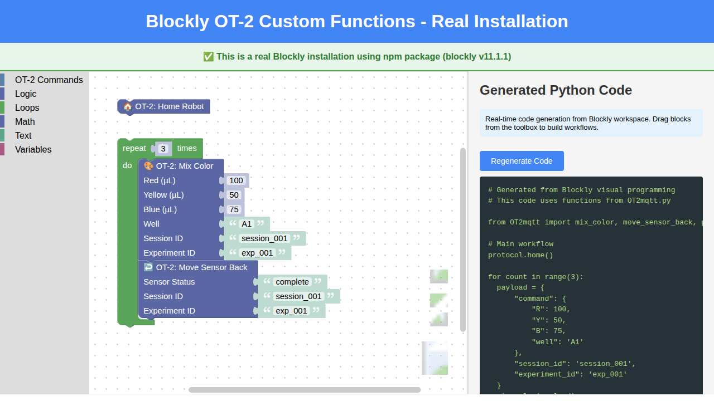

# Blockly OT-2 Integration - Real Installation

This is a **real Blockly installation** using the official `blockly` npm package (v12.3.1), not a mock-up or concept demo. It demonstrates how Blockly can be integrated with custom functions from `OT2mqtt.py`.

## What This Is

- ✅ **Real npm package installation** of Blockly
- ✅ **Webpack bundled** application
- ✅ **Custom blocks** for OT-2 functions
- ✅ **Real-time Python code generation**
- ✅ **Fully functional** drag-and-drop interface

## Screenshot



The screenshot shows the actual Blockly editor running with custom OT-2 blocks generating real Python code.

## Installation

The application is already built and ready to use. If you need to rebuild:

```bash
cd scripts/blockly_app
npm install
npm run build
```

## Running the Application

### Option 1: Using webpack-dev-server (Recommended)

```bash
cd scripts/blockly_app
npm start
```

This will start a development server and automatically open the application in your browser at `http://localhost:8080`.

### Option 2: Using Python HTTP Server

```bash
cd scripts/blockly_app/dist
python -m http.server 8081
```

Then navigate to `http://localhost:8081/index.html` in your browser.

## Custom Blocks

The application includes three custom blocks that map to OT2mqtt.py functions:

### 1. 🏠 OT-2: Home Robot
- **Function**: `protocol.home()`
- **Purpose**: Homes the OT-2 robot to its initial position
- **Parameters**: None

### 2. 🎨 OT-2: Mix Color
- **Function**: `mix_color(payload)`
- **Purpose**: Mix RGB colors in a specified well using the OT-2 pipette
- **Parameters**:
  - Red (µL): Volume of red paint
  - Yellow (µL): Volume of yellow paint
  - Blue (µL): Volume of blue paint
  - Well: Target well position (e.g., "A1")
  - Session ID: Experiment session identifier
  - Experiment ID: Experiment identifier

### 3. ↩️ OT-2: Move Sensor Back
- **Function**: `move_sensor_back(payload)`
- **Purpose**: Return the sensor to charging position
- **Parameters**:
  - Sensor Status: Status of the sensor (e.g., "complete")
  - Session ID: Experiment session identifier
  - Experiment ID: Experiment identifier

## Example Workflow

The application loads with a pre-built example workflow:

1. Home the OT-2 robot
2. Repeat 3 times:
   - Mix colors (100µL red, 50µL yellow, 75µL blue) in well A1
   - Move sensor back to charging position

This generates the following Python code:

```python
# Generated from Blockly visual programming
# This code uses functions from OT2mqtt.py

from OT2mqtt import mix_color, move_sensor_back, protocol

# Main workflow
protocol.home()

for count in range(3):
    payload = {
        "command": {
            "R": 100,
            "Y": 50,
            "B": 75,
            "well": 'A1'
        },
        "session_id": 'session_001',
        "experiment_id": 'exp_001'
    }
    mix_color(payload)
    
    payload = {
        "command": {
            "sensor_status": 'complete'
        },
        "session_id": 'session_001',
        "experiment_id": 'exp_001'
    }
    move_sensor_back(payload)
```

## Project Structure

```
blockly_app/
├── dist/              # Built application (served to browser)
│   ├── index.html    # Main HTML file
│   └── bundle.js     # Webpack bundled JavaScript
├── src/
│   └── index.js      # Main application code with custom blocks
├── node_modules/      # Dependencies (including real Blockly)
├── package.json       # npm configuration
└── webpack.config.js  # Webpack configuration
```

## How It Works

1. **Custom Block Definition**: Each OT-2 function is defined as a Blockly block in `src/index.js`:
   ```javascript
   Blockly.Blocks['ot2_mix_color'] = {
     init: function() {
       // Block configuration
     }
   };
   ```

2. **Python Code Generator**: Each block has a corresponding code generator:
   ```javascript
   pythonGenerator.forBlock['ot2_mix_color'] = function(block, generator) {
     // Generate Python code
   };
   ```

3. **Real-time Updates**: The workspace listens for changes and regenerates code automatically:
   ```javascript
   workspace.addChangeListener(generateCode);
   ```

## Dependencies

- `blockly`: ^12.3.1 - Official Blockly library
- `webpack`: ^5.102.1 - Module bundler
- `webpack-cli`: ^6.0.1 - Webpack command line interface
- `webpack-dev-server`: ^5.2.2 - Development server

## Adding More Custom Blocks

To add additional OT2mqtt.py functions as Blockly blocks:

1. **Define the block** in `src/index.js`:
   ```javascript
   Blockly.Blocks['your_block_name'] = {
     init: function() {
       this.appendValueInput('PARAM1')
           .setCheck('Number')
           .appendField('Parameter 1');
       this.setPreviousStatement(true, null);
       this.setNextStatement(true, null);
       this.setColour(230);
     }
   };
   ```

2. **Add the code generator**:
   ```javascript
   pythonGenerator.forBlock['your_block_name'] = function(block, generator) {
     const param1 = generator.valueToCode(block, 'PARAM1', pythonGenerator.ORDER_ATOMIC);
     return `your_function(${param1})\n`;
   };
   ```

3. **Add to toolbox** in the `toolbox` object

4. **Rebuild**: Run `npm run build`

## Comparison with Concept Demo

This real installation differs from the standalone concept demo (`blockly_concept_demo.html`):

| Feature | Real Installation | Concept Demo |
|---------|------------------|--------------|
| Blockly Source | npm package | Mock-up visualization |
| Installation | Requires npm install | No dependencies |
| Functionality | Fully interactive | Static demonstration |
| Code Generation | Real Blockly Python generator | N/A |
| Extensibility | Full Blockly API | Limited |
| Use Case | Development & Production | Documentation |

## References

- [Blockly Official Documentation](https://developers.google.com/blockly)
- [Blockly Getting Started](https://blocklycodelabs.dev/codelabs/getting-started/index.html)
- [Blockly Custom Blocks](https://developers.google.com/blockly/guides/create-custom-blocks/overview)
- [OT2mqtt.py Functions](../../src/ac_training_lab/ot-2/_scripts/OT2mqtt.py)

## Troubleshooting

### npm install fails
```bash
# Set longer timeout and retry
export PIP_TIMEOUT=600
export PIP_RETRIES=2
npm install
```

### Webpack build fails
```bash
# Clean install
rm -rf node_modules package-lock.json
npm install
npm run build
```

### Browser shows blank page
- Check that `bundle.js` exists in `dist/` directory
- Check browser console for errors
- Ensure you're accessing the correct URL

## Next Steps

To integrate this with actual OT-2 hardware:

1. Deploy the application to a web server accessible to OT-2
2. Add a backend API to receive generated Python code
3. Validate and execute the code on the OT-2
4. Add authentication and authorization
5. Integrate with MQTT broker for real-time communication

---

**This is a real, working Blockly installation** that demonstrates the practical integration of visual programming with laboratory automation. The generated Python code can be directly executed on an OT-2 robot with appropriate backend infrastructure.
